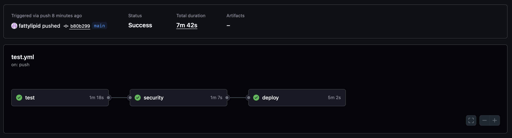

# 🌸✨ Calculator Project ✨🌸

Welcome to the **Final Calculator Project**  

---

## 🎯 Objective
Add **one new feature** to our application, fully integrated into the **backend**, **frontend**, and **tests**, then ship it off in a shiny Docker container!  
You’ll flex your skills in:
- 🛠 FastAPI (Backend)
- 📦 SQLAlchemy (Database)
- 🖥 Frontend UI updates
- ✅ Testing (Unit, Integration, E2E)
- 🐳 Docker + GitHub Actions

---

## 💡 Feature Choices
Pick your flavor of enhancement:

1. **👤 User Profile & Password Change**
   - Update username/email
   - Change password (securely hashed)
   - Full flow test: Login → Profile → Change → Re-login

2. **➕ Advanced Calculation**
   - Add a cool new operation (✨ exponentiation, square root, or your own idea!)
   - Update routes, schemas, and frontend
   - Test logic, API, and UI

3. **📊 Report / History Dashboard**
   - Track stats (e.g., total calculations, averages)
   - Show metrics in UI
   - Full backend + frontend integration

---

## 🛠 Development Steps
### Backend (FastAPI)
- Update **SQLAlchemy models** (if needed)
- Create **Pydantic schemas**
- Add new **FastAPI routes**
- Implement logic for your chosen feature

### Frontend
- Add new **pages** or extend existing ones
- Include **client-side validations**
- Keep it **cute but functional**

### Testing
- **Unit Tests:** New logic & functions
- **Integration Tests:** Routes + DB
- **E2E Tests:** Playwright flow tests (happy + unhappy paths)

---

## 📂 How to Run Locally
```bash
# 1️⃣ Clone repo
git clone <your-repo-url>
cd <your-repo-name>

# 2️⃣ Install dependencies
pip install -r requirements.txt

# 3️⃣ Run FastAPI app
uvicorn app.main:app --reload

# 4️⃣ Visit:
http://localhost:8000
```

---

## 🧪 Running Tests
```bash
# Unit & Integration Tests
pytest

# E2E Tests (Playwright)
pytest --headed --browser chromium
```

---

## 🐳 Docker Hub Deployment
```bash
# Build
docker build -t <your-dockerhub-username>/<image-name> .

# Run
docker run -p 8000:8000 <your-dockerhub-username>/<image-name>
```

Click [**here**](https://hub.docker.com/r/fattylipid/is601final) for my Docker Hub repository!

---

## 🎀 CI/CD (GitHub Actions)
Your pipeline will:
- Run all tests
- Build Docker image
- Push image to Docker Hub (if all tests pass ✅)



---

## 🌟 Submission Checklist
- Code & tests pushed to GitHub
- Updated README (this one!)
- Docker Hub link included
- Feature fully working (backend + frontend + tests)

---

## Done! 🎀